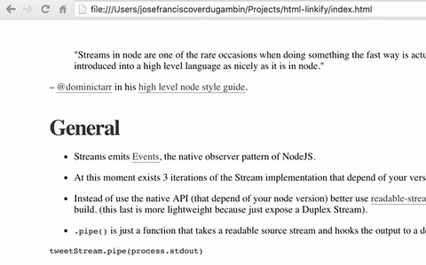

# linkify

<p align="center">
  <br>
  
  <br>
</p>


[](https://travis-ci.org/Kikobeats/linkify)
[](https://david-dm.org/Kikobeats/linkify)
[](https://david-dm.org/Kikobeats/linkify#info=devDependencies)
[](https://www.npmjs.org/package/linkify)
[](https://paypal.me/Kikobeats)

> It converts HTML tags (like h1, h2, h3, h4, h5 & h6) into links.

## Install

```bash
$ npm install linkify --save
```

If you want to use in the browser (powered by [Browserify](http://browserify.org/)):

```bash
$ bower install linkify --save
```

and later link in your HTML:

```html
<script src="bower_components/linkify/dist/linkify.js"></script>
```

## Usage

**Note:** You need to use a DOM Selector.

API and default values are:

```js
var linkify = require('linkify')
$('h2').linkify() // provide selector to create link wrapper
```

## License

MIT © [Kiko Beats](http://kikobeats.com)
